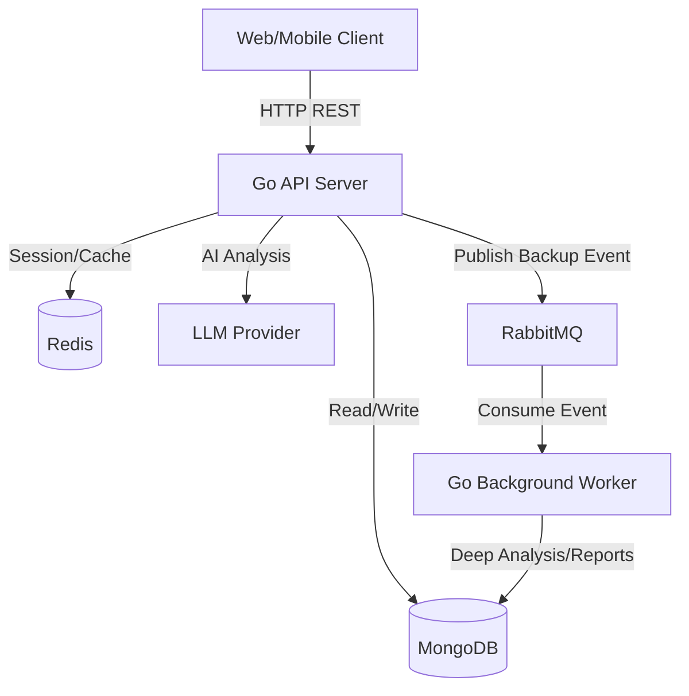

# ScrumAI: A Distributed System for AI-Assisted Scrum Management

## 1. Introduction + Idea + Originality
**ScrumAI** is a distributed system designed to revolutionize daily standups and sprint tracking. Traditional scrum tools rely on manual updates which are often forgotten or lacked depth. 

**The Idea**: Users submit their daily standups (transcripts). The system processes these using Large Language Models (GPT-4o, Gemini, or etc.) to automatically extract:
- **Completed Tasks**: What has been achieved.
- **In-Progress & Planned Tasks**: Current and future work.
- **Blockers**: Identifying dependencies or issues that stop progress.
- **AI Insights**: Providing high-level overview of team health and sentiment.

**Originality**: ScrumAI combines a **clean architecture** with **advanced AI parsing**. It transforms raw meeting transcripts into structured actionable data synchronously upon submission, ensuring immediate visibility into team progress while maintaining a scalable distributed backend.

## 2. Architecture and Design
The system follows **Clean Architecture** and is composed of several independent services.

### Architecture Description
- **API Server**: Handles authentication, standup submission, and report retrieval.
- **Background Worker**: Processes heavy AI analysis tasks asynchronously.
- **Message Broker (RabbitMQ)**: Decouples the API from the Worker, ensuring the API stays responsive.
- **Databases**: MongoDB for persistent document storage and Redis for high-speed session management.

### Diagram

## 3. Technologies Used
- **Backend**: Go (Golang) for high performance and concurrency.
- **API Framework**: Gin Gonic.
- **Database**: MongoDB (NoSQL) for flexible schema.
- **Caching/Sessions**: Redis.
- **Messaging**: RabbitMQ (AMQP).
- **AI**: OpenAI GPT-4o.
- **Security**: JWT (JSON Web Tokens) + Bcrypt.
- **Containerization**: Docker & Docker Compose.

## 4. API Design
The API follows RESTful principles and is versioned under `/api/v1`. Key modules include:
- **Auth**: Secure session management.
- **Standups**: CRUD operations for daily updates.
- **Reports**: AI-generated insights and blockers.

## 5. Distributed Systems Concepts
| Course Topic | Project Implementation |
| :--- | :--- |
| **Distributed Systems** | Multi-node architecture (API, Worker, DBs). |
| **Client-Server** | RESTful interaction between clients and Go API. |
| **Layered Architecture** | Clean Architecture (Domain, App, Infra, Interface). |
| **Communication** | Sync (HTTP) and Async (AMQP/RabbitMQ). |
| **Concurrency** | Heavy use of Goroutines for non-blocking I/O. |
| **Statelessness** | API is stateless; state is externalized to Redis/Mongo. |
| **Fault Tolerance** | Queue-based persistence ensures tasks aren't lost if workers fail. |
| **Scalability** | Horizontal scaling enabled via Docker. |

## 6. Use Case Walkthrough
1. **Submit**: A developer submits a standup transcript: *"Finished the login UI but stuck on the API integration because the auth service is down."*
2. **Synchronous Analysis**: The API triggers the configured LLM provider to parse the transcript immediately.
3. **Structured Response**: Within seconds, the user receives a response with the tasks and blockers automatically extracted.
4. **Insight**: The Scrum Master opens the `Reports` dashboard and sees the bottleneck highlighted across the team, enabling faster resolution.

## 7. Conclusion and Future Work
ScrumAI successfully demonstrates how a distributed system can handle intensive AI processing while remaining responsive and reliable.

**Future Work**:
- **WebSocket Integration**: Real-time ticker for analysis updates.
- **Service Mesh**: Using Istio for better observability.
- **Distributed Tracing**: Implementing OpenTelemetry to track requests across services.
