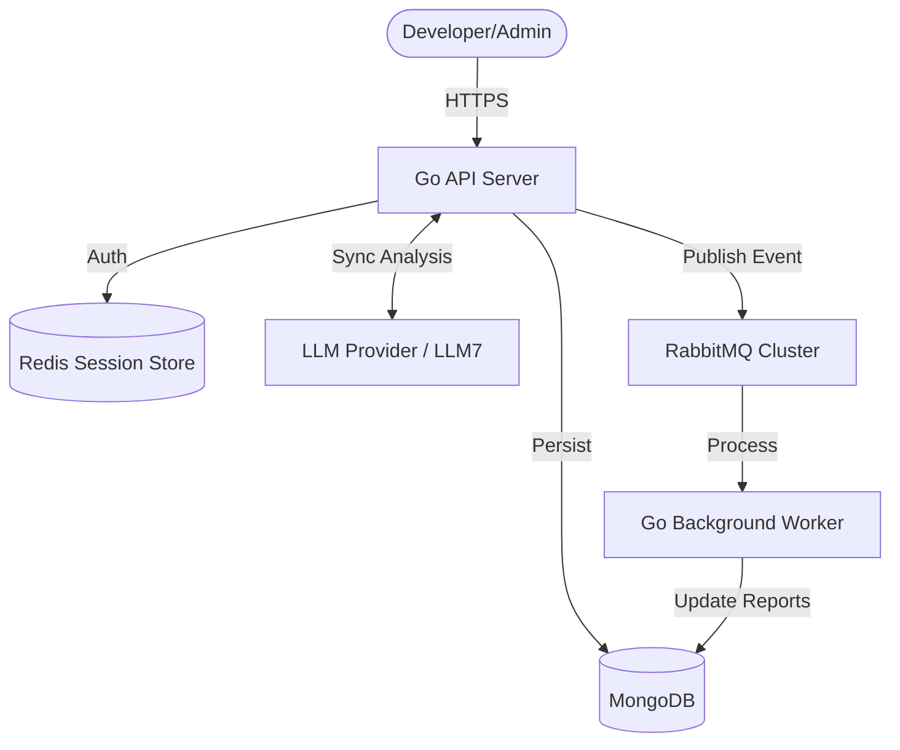

# ScrumAI: Distributed AI-Assisted Scrum Management

## 1. Executive Summary
**ScrumAI** is a next-generation distributed system designed to revolutionize how engineering teams handle daily standups and sprint velocity. By transforming raw meeting transcripts into structured, actionable data through advanced AI analysis, ScrumAI eliminates the manual overhead of updating trackers and identifies blockers before they derail a sprint.

ScrumAI is built as a highly scalable, multi-service platform using **Go**, **React**, and a distributed message-driven architecture.

---

## 2. Core Idea and Originality
The "Daily Standup" is often the most important yet least documented part of the Scrum process. 

**The Innovation**: ScrumAI captures raw human communication (text or file transcripts) and uses a custom-tuned AI pipeline to extract:
- **Completed Work**: Validation of achievements.
- **Planned Tasks**: Future commitments mapped to rolling tasks.
- **Instant Blocker Detection**: Sentiment and keyword analysis to highlight dependencies.

**Originality**: Unlike generic AI tools, ScrumAI is a purpose-built **distributed system**. It handles high-concurrency standup submissions synchronously while maintaining a background event-driven architecture for deep analysis, report aggregation, and organizational management across multiple teams.

---

## 3. Visual Product Overview

### 3.1 Live Dashboard
The Overview dashboard provides a real-time "Team Pulse". High-level metrics for standups, active blockers, and rolling tasks are updated via an automated 30-second polling engine, ensuring zero staleness.


### 3.2 AI-Powered Standup Submission
Users can submit transcripts manually or via file upload. The system provides **Immediate Synchronous Feedback**, showing exactly what the AI extracted from the transcript within seconds.


### 3.3 Dynamic AI Insights
The Reports module identifies "Rolling Tasks"—complex items that persist over multiple standups—and generates high-level management summaries of team health and sentiment.


---

## 4. Technical Architecture
ScrumAI follows **Clean Architecture (Hexagonal)** principles to ensure high maintainability and testability.

### 4.1 Distributed Components
- **API Gateway (Go/Gin)**: Orchestrates authentication, session management, and primary standup ingestion.
- **Background Worker (Go)**: Consumes analysis events from RabbitMQ to perform complex cross-standup tracking.
- **Message Broker (RabbitMQ)**: Provides the distributed backbone for asynchronous service communication.
- **Data Persistence**: 
    - **MongoDB**: Permanent storage for standups, teams, and analysis.
    - **Redis**: High-speed session store and security layer for JWT invalidation.

### 4.2 System Data Flow


---

## 5. Distributed Systems Concepts Implemented

| Concept | Implementation in ScrumAI |
| :--- | :--- |
| **Separation of Concerns** | Layered Clean Architecture (Domain -> App -> Infra). |
| **Asynchronous Messaging** | RabbitMQ ensures API responsiveness despite AI processing latency. |
| **State Externalization** | All state resides in Redis/Mongo, allowing for horizontal scalability. |
| **Persistence & Fault Tolerance** | Queue-based task persistence protects against worker outages. |
| **Security & RBAC** | Tiered Role-Based Access Control (Admin/User) enforced via JWT middleware. |
| **Bootstrapping** | Automated "First User is Admin" logic for zero-config deployment. |

---

## 6. Case Study Walkthrough
1. **The Infrastructure**: A Docker Compose file orchestrates 6 distinct containers representing the full stack.
2. **The Handover**: A developer submits a transcript with a blocker.
3. **The Distributed Response**: The API handles the user synchronously for immediate UX, while the Worker picks up the event to update the "Master Blocker List" in the background.
4. **The Management Insight**: An Admin uses the console to organize teams and monitor reports, seeing the blocker highlighted across the organizational tree.

---

## 7. Configuration and Setup

### 7.1 Docker Execution (Primary)
```bash
docker compose up --build
```

### 7.2 Manual Installation (Secondary)
The system supports manual execution for environments without Docker. Detailed logic for running the API, Worker, and Frontend individually is provided in the project [README.md](../../../README.md).

---

## 8. Conclusion
ScrumAI demonstrates the power of combining modern AI with established distributed systems principles. It provides a robust, scalable foundations for the future of automated project management.

**Technical Stack**: Go, TypeScript, React, MongoDB, Redis, RabbitMQ, Docker.
