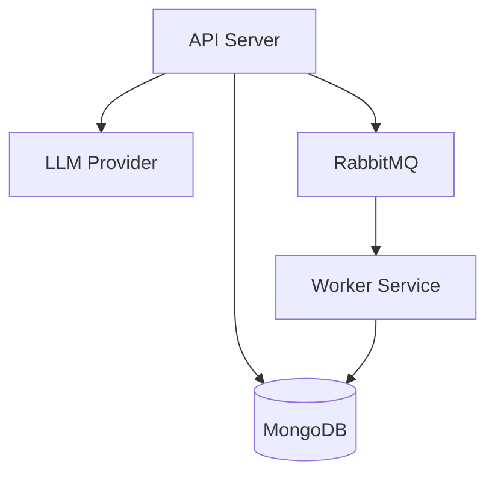

# ScrumAI – Technical Documentation

## 1. Overview
ScrumAI is a distributed web application that processes Scrum standups using AI. The system leverages independent services for orchestration, analysis, and data persistence, ensuring high availability and structured data extraction.

## 2. System Components
* **API Server (Go):** Handles request orchestration, authentication, and core business logic.
* **Worker Service (Go):** Consumes tasks from the queue and interacts with LLM providers for background analysis.
* **RabbitMQ:** Acts as the message broker for asynchronous event delivery.
* **MongoDB:** Document-based storage for standups, users, and analysis results.
* **Redis:** In-memory store for session tokens and high-frequency cache.
* **AI Providers:** Modular interface supporting LLM7 (FreeLLM), OpenAI, Gemini, and Hugging Face.

## 3. Architecture Description
The system follows a client–server model combined with synchronous AI parsing for immediate feedback, and background processing for aggregated reporting.

## 4. API Overview
The API is versioned (`/api/v1`) and documented with Swagger. Key functional areas:
* **Authentication:** Registration, Login, and Session Invalidation.
* **Standups:** Submission of text-based updates.
* **Reports:** Retrieval of AI-processed insights, rolling tasks, and team blockers.

## 5. Messaging and Processing
Standup submissions are handled synchronously by the API, which invokes the AI service to parse the content before returning the response. Additionally, an event is published to RabbitMQ (via the `standup_analysis` exchange) for background tracking and rolling task detection. This hybrid approach ensures the user gets immediate results while maintaining a robust distributed workflow.

## 6. AI Provider Strategy
The system implements a Strategy pattern for AI analysis. In `cmd/api/main.go`, a switching logic initializes the appropriate `AIService` implementation based on the `AI_PROVIDER` environment variable. This allows the system to remain model-agnostic and switch between providers (LLM7, OpenAI, Gemini) seamlessly without changing business logic.

## 7. Concurrency and Reliability
* **Goroutines:** The Go backend uses lightweight threads for handling concurrent I/O.
* **Acknowledgments:** RabbitMQ message acknowledgments ensure that tasks are only removed from the queue after successful processing.
* **Statelessness:** All service nodes are stateless, allowing for easy horizontal scaling behind a load balancer.

## 7. Security Overview
* **JWT:** Secure, stateless identity propagation across the distributed system.
* **Bcrypt:** Industry-standard hashing for user credentials.
* **Environment Isolation:** All sensitive keys (API keys, DB URIs) are managed via `.env` files and environment variables.

## 8. Known Limitations
* **AI Latency:** Analysis time is subject to OpenAI API response times.
* **Real-time Feedback:** Currently requires polling; real-time updates are a future enhancement.
