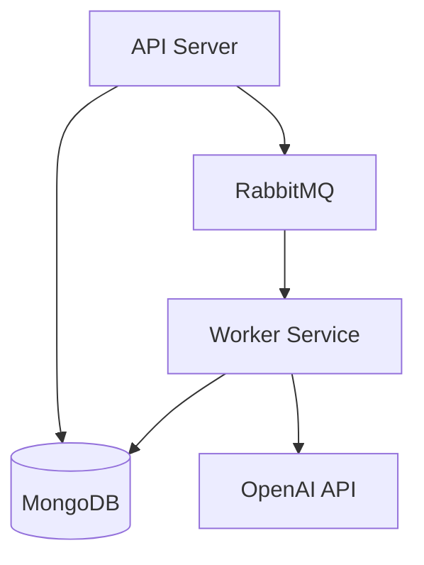

# ScrumAI – Technical Documentation

## 1. Overview
ScrumAI is a distributed web application that asynchronously processes Scrum standups using AI. The system is composed of independent services communicating via REST and message queues.

## 2. System Components
* **API Server (Go):** Handles request orchestration, authentication, and core business logic.
* **Worker Service (Go):** Consumes tasks from the queue and interacts with the OpenAI API for analysis.
* **RabbitMQ:** Acts as the message broker for asynchronous event delivery.
* **MongoDB:** Document-based storage for standups, users, and analysis results.
* **Redis:** In-memory store for session tokens and high-frequency cache.

## 3. Architecture Description
The system follows a client–server model combined with event-driven processing. User requests are handled synchronously by the API, while AI processing is handled asynchronously by background workers.

## 4. API Overview
The API is versioned (`/api/v1`) and documented with Swagger. Key functional areas:
* **Authentication:** Registration, Login, and Session Invalidation.
* **Standups:** Submission of text-based updates.
* **Reports:** Retrieval of AI-processed insights, rolling tasks, and team blockers.

## 5. Messaging and Processing
Standup submissions trigger events published to the `standup_analysis` exchange. Workers bind to the `standup_analysis_queue` to consume these messages. This decoupling allows the API to return a success response to the user immediately.

## 6. Concurrency and Reliability
* **Goroutines:** The Go backend uses lightweight threads for handling concurrent I/O.
* **Acknowledgments:** RabbitMQ message acknowledgments ensure that tasks are only removed from the queue after successful processing.
* **Statelessness:** All service nodes are stateless, allowing for easy horizontal scaling behind a load balancer.

## 7. Security Overview
* **JWT:** Secure, stateless identity propagation across the distributed system.
* **Bcrypt:** Industry-standard hashing for user credentials.
* **Environment Isolation:** All sensitive keys (API keys, DB URIs) are managed via `.env` files and environment variables.

## 8. Known Limitations
* **AI Latency:** Analysis time is subject to OpenAI API response times.
* **Real-time Feedback:** Currently requires polling; real-time updates are a future enhancement.
